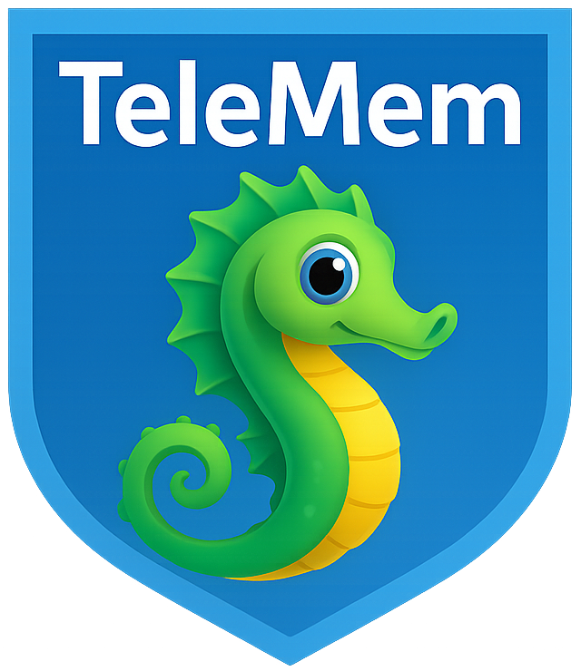
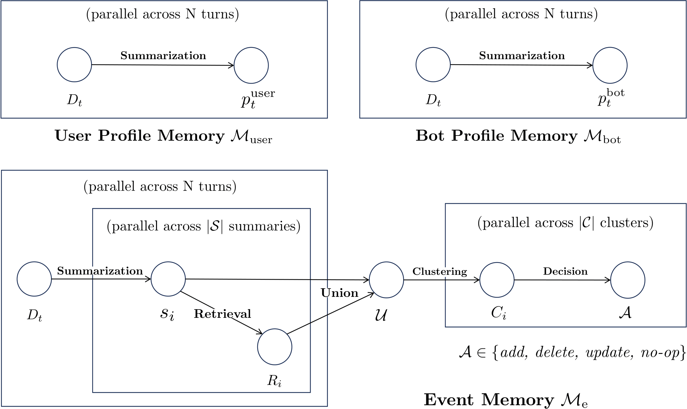

<p align="center">
  <a href="https://github.com/TeleAI-UAGI/telemem">
    
  </a>
</p>

<h1 align="center"> TeleMem: Building Long-Term and Multimodal Memory for Agentic AI </h1>

<p align="center">
  <a href="docs/TeleMem_Tech_Report.pdf">
    
  </a>
  <a href="https://github.com/TeleAI-UAGI/telemem">
    
  </a>
  <a href="https://github.com/TeleAI-UAGI/TeleMem/blob/main/LICENSE">
    
  </a>
  
  
</p>

<div align="center">

**如果这个开源项目对您有帮助，请给我们一个⭐️.**

_🤝 欢迎参与、合作! Feel free to open an issue or submit a pull request._


</div>

---

<div align="center">
  <p>
      <a href="README.md">English</a> | <a href="README-ZH.md">简体中文</a>
  </p>
  <p>
      <a href="https://github.com/TeleAI-UAGI/Awesome-Agent-Memory">   <p>
      <a href="https://github.com/TeleAI-UAGI/Awesome-Agent-Memory"> <strong>📄 Awesome-Agent-Memory →</strong></a>
  </p>
</div>

TeleMem是一个大模型智能体的长期记忆管理系统，面向**多轮对话、角色建模、长期信息存储与语义检索**的复杂场景深度优化，<mark>**仅改一行代码即可无缝替换[Mem0](https://mem0.ai/)**（`import telemem as mem0`）</mark>。

通过独特的上下文感知增强机制，TeleMem为对话式AI提供了**更高准确率、更快性能、更强角色记忆能力**的核心基础设施。

在此基础上，实现了**视频理解、多模态推理与视觉问答** 能力，通过视频帧提取、字幕生成、向量数据库构建的完整流水线，使 AI Agent 能够像处理文本记忆一样，轻松**存储、检索和推理视频内容**。

TeleMem的终极目标是令智能体 _积后见之明（hindsight）、致深谋远虑(foresight)_ 。

**TeleMem，使记忆持续、让智慧生长。**

---

## 📢 最新动态

- **[2026-01-28] 🎉 TeleMem [v1.3.0](https://github.com/TeleAI-UAGI/telemem/releases/tag/v1.3.0) 版本发布!**
- **[2026-01-22] 🎉 TeleMem [技术报告](https://arxiv.org/abs/2601.06037) 已经更新至第4版!**
- **[2026-01-13] 🎉 TeleMem [技术报告](https://arxiv.org/abs/2601.06037) 已经在arXiv上发布!**
- **[2026-01-09] 🎉 TeleMem [v1.2.0](https://github.com/TeleAI-UAGI/telemem/releases/tag/v1.2.0) 版本发布!**
- **[2025-12-31] 🎉 TeleMem [v1.1.0](https://github.com/TeleAI-UAGI/telemem/releases/tag/v1.1.0) 版本发布!**
- **[2025-12-05] 🎉 TeleMem [v1.0.0](https://github.com/TeleAI-UAGI/telemem/releases/tag/v1.0.0) 版本发布!**

---

## 🔥 研究亮点

* **记忆准度显著提升**：在 ZH-4O 中文长角色对话基准测试中，准确率较 Mem0 提升**19%**，达到 **86.33%**
* **速度性能翻倍提升**：高效缓冲区策略 + 批处理写入，实现毫秒级语义检索
* **Token成本大幅降低**：优化 Token 使用量，在相同性能下显著降低 LLM 开销
* **角色记忆精准保存**：自动为每个角色建立独立记忆档案，不再混淆
* **自动视频处理流水线**：从原始视频 → 帧提取 → 字幕生成 → 向量数据库，全自动完成
* **ReAct 风格视频问答**：多步推理 + 工具调用，实现精准的视频内容理解

---

## 📌 目录

* [项目介绍](#项目介绍)
* [TeleMem vs Mem0：核心优势](#telemem-vs-mem0核心优势)
* [实验结果](#实验结果)
* [快速使用](#快速使用)
* [项目结构](#项目结构)
* [核心功能](#核心功能)
* [多模态扩展](#多模态扩展)
* [数据存储](#数据存储)
* [开发与贡献](#开发与贡献)
* [致谢](#致谢)

---

## 项目介绍

TeleMem 通过一套深度优化的**角色化摘要生成 → 语义聚类去重 → 高效存储 → 精准检索**的完整流程，使对话式 AI 在长周期交互中能够保持稳定、自然、连续的世界观与角色设定。

### 功能

* **自动记忆提取**：从对话中自动抽取关键记忆并进行结构化存储。
* **语义聚类去重**：使用 LLM 对高度相似记忆进行语义融合，减少冲突、提升一致性。
* **角色化档案管理**：为对话中不同角色建立独立记忆档案，实现记忆的精准隔离与专属管理。
* **高效异步写入**：采用缓冲区 + 批量写入机制，实现高性能持久化存储，兼顾速度与稳定性。
* **语义精准检索**：FAISS + JSON 双存储方式，召回记忆快速又可审计。

### 适用场景

* 多角色虚拟Agent系统
* 长期记忆型 AI 助手（客服、陪伴、创作辅助）
* 复杂虚拟剧情 / 世界观构建
* 强上下文依赖的对话交互场景
* 视频内容问答与推理
* 多模态 Agent 记忆管理
* 长视频理解与信息检索



---

## TeleMem vs Mem0：核心优势

TeleMem 相比于 Mem0 针对 **角色化、长期化、高性能** 核心需求完成深度重构，关键能力差异如下：


| 能力维度       | Mem0          | TeleMem                                                             |
| -------------- | --------------- | ------------------------------------------------------------------- |
| 多角色记忆分离 | ❌ 不支持       | ✅ 自动为对话中不同角色创建独立记忆档案，实现记忆精准隔离与专属管理 |
| 摘要质量   | 基础摘要  | ✅**上下文感知 + 角色聚焦** 双 prompt，覆盖关键名词、动作、时间    |
| 去重机制   | 向量相似度过滤  | ✅**LLM 聚类融合**：对相似记忆调用 LLM 进行语义级更新/去重          |
| 写入性能       | 单条流式写入    | ✅**缓冲区缓存 + 批量 Flush + 并发处理**，写入效率提升 2-3 倍       |
| 存储格式       | SQLite / 向量库 | ✅**FAISS + JSON 元数据双写**：兼顾高效检索与人类可读性             |
| 多模态能力 | 仅支持单张图像转文字  |✅**视频多模态记忆**：支持完整视频处理流水线 + ReAct 多步推理问答      |
---

## 实验结果

### 数据集

项目采用论文[MOOM: Maintenance, Organization and Optimization of Memory in Ultra-Long Role-Playing Dialogues](https://arxiv.org/abs/2509.11860)构建的 ZH-4O 中文长角色对话数据集：

* 平均对话轮次：600 轮 / 对话
* 覆盖场景：日常交互、剧情推进、角色关系演变

数据集的记忆能力评测采用问答形式，示例如下：

```json
{
  "question": "赵齐对白羽岚的昵称是什么？A 小白 B 小羽 C 岚岚 D 羽羽",
  "answer": "A"
},
{
  "question": "赵齐和白羽岚是什么关系？A 同学 B 老师和学生 C 敌人 D 邻居",
  "answer": "B"
}
```

### 实验配置

* 大语言模型：统一使用[ Qwen3-8B](https://huggingface.co/Qwen/Qwen3-8B)，关闭thinking模式
* 嵌入模型：统一使用 [Qwen3-Embedding-8B](https://huggingface.co/Qwen/Qwen3-Embedding-8B)
* 评价指标：记忆问答准确率

    | Method                                                    | Overall(%) |
    |:--------------------------------------------------------- |:---------- |
    | RAG                                                       | 62.45      |
    | _[Mem0](https://github.com/mem0ai/mem0)_                  | _70.20_    |
    | [MOOM](https://github.com/cows21/MOOM-Roleplay-Dialogue)  | 72.60      |
    | [A-mem](https://github.com/agiresearch/A-mem)             | 73.78      |
    | [Memobase](https://github.com/memodb-io/memobase)         | 76.78      |
    | **[TeleMem](https://github.com/TeleAI-UAGI/TeleMem)**     | **86.33**  |

<!--
    | Long-Context LLM (Slow and Expensive)                     | 84.92      |
-->

---

## 快速使用

### 环境准备

```shell
# 创建并激活虚拟环境
conda create -n telemem python=3.10
conda activate telemem

# 安装依赖
pip install -e .
```

### 示例

设置OpenAI API key
```shell
export OPENAI_API_KEY="your-openai-api-key"
```

```python
import telemem as mem0

memory = mem0.Memory()

messages = [
    {"role": "user", "content": "Jordan, did you take the subway to work again today?"},
    {"role": "assistant", "content": "Yes, James. The subway is much faster than driving. I leave at 7 o'clock and it's just not crowded."},
    {"role": "user", "content": "Jordan, I want to try taking the subway too. Can you tell me which station is closest?"},
    {"role": "assistant", "content": "Of course, James. You take Line 2 to Civic Center Station, exit from Exit A, and walk 5 minutes to the company."}
]

memory.add(messages=messages, user_id="Jordan")
results = memory.search("What transportation did Jordan use to go to work today?", user_id="Jordan")
print(results)
```

默认情况下，`Memory()` 会自动配置以下组件：
- 使用 OpenAI 的 gpt-4.1-nano-2025-04-14 模型进行摘要提取与更新  
- 使用 OpenAI 的 text-embedding-3-small 嵌入模型（1536 维）  
- 使用 Faiss 向量存储，并将数据保存在磁盘上  

如果需要自定义配置，请修改 `config/config.yaml` 文件。

---

## 项目结构

<details>
<summary>展开/收起 目录结构</summary>

```
telemem/
├── assets/                   # 文档资源与插图素材
├── vendor/
│   └── mem0/                 # 上游 Mem0 仓库源代码（通过 git subtree 引入）
├── overlay/
│   └── patches/              # TeleMem 自定义补丁文件（.patch），用于扩展与修改上游代码
├── scripts/                  # Overlay 管理与自动化脚本
│   ├── init_upstream.sh      # 初始化上游 subtree 仓库
│   ├── update_upstream.sh    # 同步上游更新并重新应用 TeleMem 补丁
│   ├── record_patch.sh       # 将本地代码修改记录为可复现的补丁文件
│   └── apply_patches.sh      # 应用补丁构建 TeleMem 完整代码
├── baselines/                # 对比评测使用的基线方法实现
│   ├── RAG                   # Retrieval-Augmented Generation（检索增强生成）基线
│   ├── MemoBase              # MemoBase 记忆管理系统
│   ├── MOOM                  # MOOM 双分支叙事记忆框架
│   ├── A-mem                 # A-mem 智能体记忆系统基线
│   └── Mem0                  # Mem0 基线实现
├── data/                     # 用于评测或演示的小规模示例数据集
├── examples/                 # 示例代码与教程 Demo
│   ├── quickstart.py         # 快速入门示例（文本记忆）
│   └── quickstart_mm.py      # 快速入门示例（多模态记忆）
├── docs/                     # 项目文档、教程与开发者指南
│   ├── TeleMem-Overlay.md    # Overlay 开发指南（英文版）
│   └── TeleMem-Overlay-ZH.md # Overlay 开发指南（中文版）
├── telemem/                  # TeleMem 源码实现
├── tests/                    # TeleMem 测试
├── PATCHES.md                # TeleMem 补丁列表及功能说明
├── README.md                 # 项目说明文档（英文版）
├── README-ZH.md              # 项目说明文档（中文版）
└── pyproject.toml            # TeleMem 环境配置
```

</details>

---

## 核心功能

### 添加记忆(add)

add() 是 TeleMem 的核心方法，用于将一轮或多轮对话注入记忆系统。

```python
def add(
    self,
    messages,
    *,
    user_id: Optional[str] = None,
    agent_id: Optional[str] = None,
    run_id: Optional[str] = None,
    metadata: Optional[Dict[str, Any]] = None,
    infer: bool = True,
    memory_type: Optional[str] = None,
    prompt: Optional[str] = None,
)
```

#### 🔎 参数说明


| 参数名                     | 类型                 | 是否必填 | 说明                                                                       |
| -------------------------- | -------------------- | -------- | -------------------------------------------------------------------------- |
| messages                   | List[Dict[str, str]] | ✅ 是    | 对话消息列表，每条包含role（user/assistant）和content                      |
| metadata                   | Dict[str, Any]       | ✅ 是    | 元数据字典，必须包含：<br/>・sample\_id：会话唯一标识<br/>・user：角色列表 |
| user\_id/agent\_id/run\_id | Optional[str]        | ❌ 否    | Mem0 兼容参数，TeleMem 中可传 None                                       |
| infer                      | bool                 | ❌ 否    | 是否自动生成记忆摘要（默认 True）                                          |
| memory\_type               | Optional[str]        | ❌ 否    | 记忆类型标识（默认自动分类）                                               |
| prompt                     | Optional[str]        | ❌ 否    | 自定义摘要生成 Prompt（默认使用优化版 Prompt）                             |

#### 🔁 add() 内部流程

1. **消息预处理**：合并连续同角色消息，标准化 user/assistant 轮次格式
2. **多维度摘要生成**：
   * 全局事件摘要：描述本轮对话核心事件
   * 角色 1 视角摘要：聚焦角色 1 的行为、偏好、关系
   * 角色 2 视角摘要：聚焦角色 2 的行为、偏好、关系
3. **向量化与相似检索**：生成摘要向量，检索已有相似记忆
4. **批量处理**：达到缓冲区阈值后，调用 LLM 对相似记忆进行智能融合
5. **持久化存储**：同时写入 FAISS 向量库（检索）和 JSON 文件（元数据）

---

### 搜索记忆(search)

基于语义向量检索相关记忆，支持精准的上下文召回。

```python
def search(
    self,
    query: str,
    *,
    user_id: Optional[str] = None,
    agent_id: Optional[str] = None,
    run_id: Optional[str] = None,
    limit: int = 5,
    filters: Optional[Dict[str, Any]] = None,
    threshold: Optional[float] = None,
    rerank: bool = True,
)
```

#### 🔎 参数说明


| 参数名             | 类型           | 是否必填 | 说明                                      |
| ------------------ | -------------- | -------- | ----------------------------------------- |
| query              | str            | ✅ 是    | 检索查询文本（自然语言问题）              |
| run\_id            | str            | ✅ 是    | 会话标识，必须与 add 时的 sample\_id 一致 |
| limit              | int            | ❌ 否    | 返回记忆条数上限（默认 5 条）             |
| threshold          | float          | ❌ 否    | 相似度阈值（0-1，默认自动适配）           |
| filters            | Dict[str, Any] | ❌ 否    | 自定义过滤条件（如角色、时间范围）        |
| rerank             | bool           | ❌ 否    | 是否对检索结果重排序（默认 True）         |
| user\_id/agent\_id | Optional[str]  | ❌ 否    | Mem0 兼容参数，无实际作用                |

> 🔍 搜索基于 FAISS 向量检索，支持毫秒级响应。

---

## 多模态扩展

在文本记忆之外，TeleMem 进一步扩展了多模态能力。借鉴 [Deep Video Discovery](https://github.com/microsoft/DeepVideoDiscovery) 的 Agentic Search 与 Tool Use 思路，我们在 TeleMemory 类中实现了两个核心方法，支持视频内容的智能存储与语义检索。

| 方法 | 功能说明 |
|------|----------|
| `add_mm()` | 将视频处理为可检索的记忆（帧提取 → 字幕生成 → 向量数据库） |
| `search_mm()` | 使用自然语言查询视频内容，支持 ReAct 风格多步推理 |

### 添加多模态记忆 (add_mm)

```python
def add_mm(
    self,
    video_path: str,
    *,
    frames_root: str = "video/frames",
    captions_root: str = "video/captions",
    vdb_root: str = "video/vdb",
    clip_secs: int = None,
    emb_dim: int = None,
    subtitle_path: str | None = None,
)
```

#### 🔎 参数说明

| 参数名 | 类型 | 是否必填 | 说明 |
|--------|------|----------|------|
| video_path | str | ✅ 是 | 源视频文件路径，如 `"video/3EQLFHRHpag.mp4"` |
| frames_root | str | ❌ 否 | 帧输出根目录（默认 `"video/frames"`） |
| captions_root | str | ❌ 否 | 字幕 JSON 输出根目录（默认 `"video/captions"`） |
| vdb_root | str | ❌ 否 | 向量数据库输出根目录（默认 `"video/vdb"`） |
| clip_secs | int | ❌ 否 | 每个片段的秒数，覆盖 config.CLIP_SECS |
| emb_dim | int | ❌ 否 | Embedding 维度，默认从配置读取 |
| subtitle_path | str | ❌ 否 | 字幕文件路径（.srt），可选 |

#### 🔁 add_mm() 内部流程

1. **帧提取**：`decode_video_to_frames` - 按配置的 FPS 将视频解码为 JPEG 帧
2. **字幕生成**：`process_video` - 使用 VLM（如 Qwen3-Omni）为每个片段生成详细描述
3. **向量数据库构建**：`init_single_video_db` - 生成 Embedding 用于语义检索

> 💡 **智能缓存**：如果某一阶段的目标文件已存在，会自动跳过该阶段，节省计算资源。

#### 返回值示例

```python
{
    "video_name": "3EQLFHRHpag",
    "frames_dir": "data/samples/video/frames/3EQLFHRHpag/frames",
    "caption_json": "data/samples/video/captions/3EQLFHRHpag/captions.json",
    "vdb_json": "data/samples/video/vdb/3EQLFHRHpag/3EQLFHRHpag_vdb.json"
}
```

---

### 搜索多模态记忆 (search_mm)

```python
def search_mm(
    self,
    question: str,
    video_db_path: str = "video/vdb/3EQLFHRHpag_vdb.json",
    video_caption_path: str = "video/captions/captions.json",
    max_iterations: int = 15,
)
```

#### 🔎 参数说明

| 参数名 | 类型 | 是否必填 | 说明 |
|--------|------|----------|------|
| question | str | ✅ 是 | 问题字符串（支持 A/B/C/D 多选题格式） |
| video_db_path | str | ❌ 否 | 视频向量数据库路径 |
| video_caption_path | str | ❌ 否 | 视频字幕 JSON 路径 |
| max_iterations | int | ❌ 否 | MMCoreAgent 最大推理轮数（默认 15） |

#### 🛠️ ReAct 风格推理工具

`search_mm` 内部使用 `MMCoreAgent`，采用 THINK → ACTION → OBSERVATION 循环，配备三个专用工具：

| 工具名 | 功能 |
|--------|------|
| `global_browse_tool` | 获取视频事件和主题的全局概览 |
| `clip_search_tool` | 使用语义查询搜索特定内容 |
| `frame_inspect_tool` | 检查特定时间范围的帧细节 |

---

### 多模态示例

运行多模态演示：

```bash
python examples/quickstart_mm.py
```

首次运行会在 `output_dir`（默认 `data/samples/video/`）下生成所有帧、字幕、VDB JSON。为方便复现，我们也在仓库中附带了这些中间量，可直接用于查询，无需重新计算。

完整代码示例：

```python
import telemem as mem0
import os

# 初始化模型
memory = mem0.Memory()

# 定义路径
video_path = "video/3EQLFHRHpag.mp4"
video_name = os.path.splitext(os.path.basename(video_path))[0]
output_dir = "video"
os.makedirs(output_dir, exist_ok=True)

# 第一步：写入记忆
vdb_json_path = f"{output_dir}/vdb/{video_name}/{video_name}_vdb.json"
if not os.path.exists(vdb_json_path):
    result = memory.add_mm(
        video_path=video_path,
        output_dir=output_dir,
    )
    print(f"Video processing complete: {result}")
else:
    print(f"VDB already exists: {vdb_json_path}")

# 第二步：定义查询问题
question = """The problems people encounter in the video are caused by what?
(A) Catastrophic weather.
(B) Global warming.
(C) Financial crisis.
(D) Oil crisis.
"""

# 第三步：检索记忆
messages = memory.search_mm(
    question=question,
    output_dir=output_dir,
    max_iterations=15,
)

# 提取最终答案
from core import extract_choice_from_msg
answer = extract_choice_from_msg(messages)
print(f"Answer: ({answer})")
```

---

## 数据存储

### 文本记忆存储

TeleMem 自动在./faiss\_db/目录下生成结构化存储文件，按会话和角色维度分离：

```
faiss_db/
├── session_001_events.index
├── session_001_events_meta.json  
├── session_001_person_1.index  
├── session_001_person_1_meta.json  
├── session_001_person_2.index   
└── session_001_person_2_meta.json  
```

### 📄 元数据示例（\_meta.json）

```json
{
  "summary": "角色讨论了即将进行的行动计划。",
  "sample_id": "session_001",
  "round_index": 3,
  "timestamp": "2024-01-01T00:00:00Z"
  "user": "Jordon" //仅person_*.json 中存在
}
```

> 所有记忆均包含 摘要、轮次、时间戳、角色，便于审计与调试。

------

### 多模态记忆存储

TeleMem 在 `./data/samples/video/` 目录下生成视频相关的存储文件：

```
video/
├── frames/
│   └── <video_name>/
│       └── frames/
│           ├── frame_000001_n0.00.jpg
│           ├── frame_000002_n0.50.jpg
│           └── ...
├── captions/
│   └── <video_name>/
│       ├── captions.json          # 片段描述 + 主体注册表
│       └── ckpt/                  # 断点续传检查点
│           ├── 0_10.json
│           └── 10_20.json
└── vdb/
    └── <video_name>/
        └── <video_name>_vdb.json  # 语义检索向量数据库
```

#### 📄 captions.json 结构

```json
{
    "0_10": {
        "caption": "旁白者讨论气候数据，展示融化的冰川..."
    },
    "10_20": {
        "caption": "场景转向受海平面上升影响的沿海社区..."
    },
    "subject_registry": {
        "narrator": {
            "name": "narrator",
            "appearance": ["professional attire"],
            "identity": ["climate scientist"],
            "first_seen": "00:00:00"
        }
    }
}
```

------
## 开发与贡献

* 叠加（Overlay）开发模式说明：[TeleMem-Overlay-ZH.md](docs/TeleMem-Overlay-ZH.md)
* 英文文档：[README.md](README.md)

---
## 许可证

[Apache 2.0 License](LICENSE)

---
## 致谢

TeleMem 的研发与迭代离不开开源社区的宝贵成果与前沿研究的启发，在此向以下项目 / 研究团队致以诚挚的感谢：

- [**Mem0**](https://github.com/mem0ai/mem0)
- [**Memobase**](https://github.com/memodb-io/memobase)
- [**MOOM**](https://github.com/cows21/MOOM-Roleplay-Dialogue)
- [**DVD**](https://github.com/microsoft/DeepVideoDiscovery)
- [**Memento**](https://github.com/Agent-on-the-Fly/Memento)

---

<div align="center">

**If you find this project helpful, please give us a ⭐️.**

Made with ❤️ by the Ubiquitous AGI team at TeleAI.

</div>

<div align="center" style="margin-top: 10px;">
  
  &nbsp;&nbsp;&nbsp;
  
</div>
